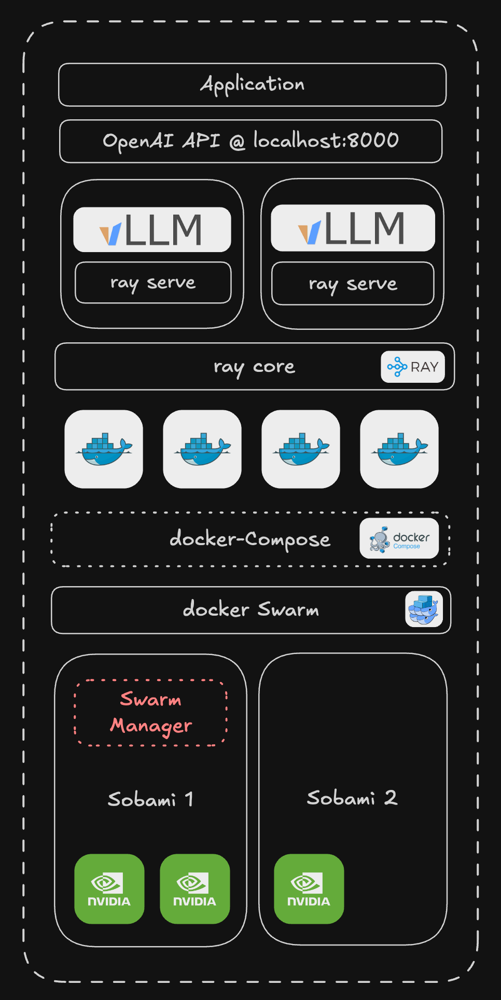

## Overview

<div style="text-align: center;">
    
    <p>Sobami Cluster Representation</p>
</div>


## Docker Stack Management Guide

Follow the tutorial to create a swarm of nodes
https://docs.docker.com/engine/swarm/swarm-tutorial/create-swarm/ 

### Basic Commands

**Generate `docker compose` Configurations**

<!-- generates the config > replaces the cpu number (12) to string ('12') > removes the first line > saves it to a file -->

```bash
docker compose --env-file .env config | sed -E "s/cpus: ([0-9\\.]+)/cpus: '\\1'/" | tail -n +2 > docker-compose-configured.yml
```

**Deploy Stack**
```bash
docker stack deploy -c docker-compose-configured.yml ray
```

**Monitor Stack**
```bash
# List all stacks
docker stack ls
# NAME      SERVICES
# ray       2

# List all services
docker service ls

# Check service status
docker service ps ray_<service-name>

# View running containers
docker ps
```
Note: Container names follow the pattern: `deployment_name.replica-number.uuid`

### Troubleshooting
If services fail:
```bash
# View complete error messages
docker service ps deployment_name --no-trunc

# Check detailed service logs
docker service logs deployment_name --details
```
