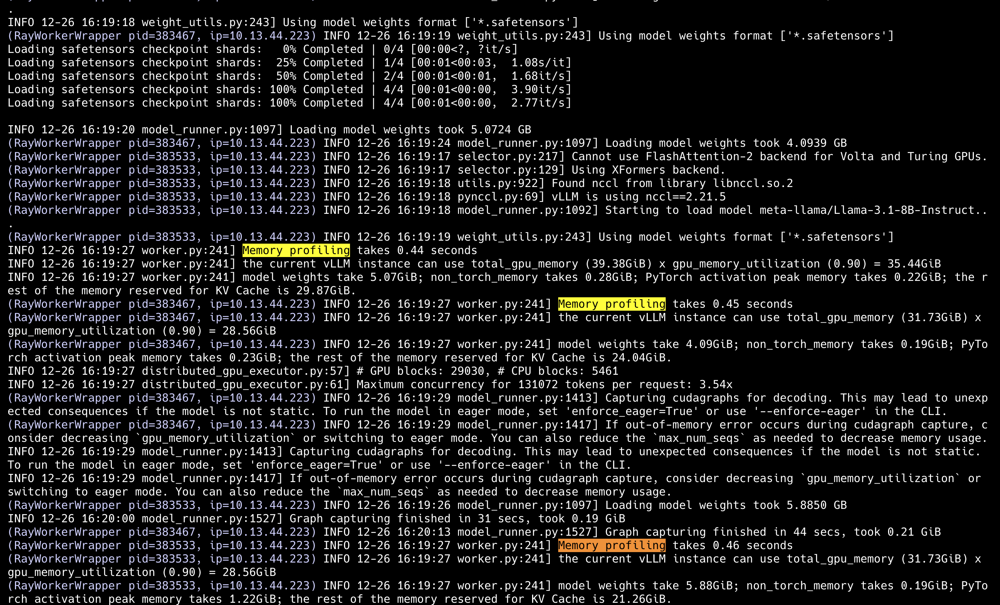

# vLLM Installation Guide

## Pre-requisites

- **OS**: Linux
- **Python**: 3.9-3.12
- **GPU**: Compute capability of 7.0 or higher
- **CUDA**: 12.1 (This might change as maintainers compile the vLLM)

## Installation

`setup.sh` will validate the GPU and CUDA dependencies to support vLLM deployment.

```bash
chmod +x setup.sh
sudo bash setup.sh
```

### Hardware and Communication Sanity Check

vLLM provides a sanity check to ensure everything is set up correctly.
<!-- TODO: understand why sanity.py does not work for our current setup. -->

## Local Node Deployment

### Environment Setup

Create and activate a conda environment for vLLM on all the nodes in the cluster. It is extremely important that all of the nodes in the cluster have the same versions of vLLM and Ray.

```bash
conda env create -f vllm.yml
```

### Ray Cluster Setup

- Start the server on a node as the host:

```bash
ray start --head --dashboard-host=0.0.0.0 --port=3002 --dashboard-port=5678
```

- Add other nodes as workers:

```bash
ray start --address="host-node-ip-address:3002"
```

### vLLM Serving

To start the vLLM serving, use the following command:

```bash
vllm serve meta-llama/Llama-3.1-8B-Instruct --dtype float16 --pipeline-parallel-size 3
```

<!-- TODO: Add required vLLM engine arguments, ray[serve] scaling configurations to tune the memory usage and performance. -->

## Docker Deployment

`run_cluster_docker.sh` script is used to deploy the vLLM and Ray cluster on the nodes. The script is used to start the Docker container on the nodes and configure the environment variables required for the vLLM and Ray cluster.

### Head Node Setup

`~/storage/tmp/ray` is the directory where Ray will store its session files. `~/.cache/huggingface/hub` is the directory where the Hugging Face models will be stored.

```bash
# sobami 2, network device - enp68s0f1, local-ip: 10.13.44.224
sudo bash run_cluster_docker.sh \
    vllm/vllm-openai:v0.6.6 \
    10.13.44.224 \
    --head \
    ~/.cache/huggingface/hub \
    ~/storage/tmp/ray \
    -e HF_TOKEN=<your-hf-token> \
    -e NCCL_SOCKET_IFNAME=enp68s0f1 \
    -e GLOO_SOCKET_IFNAME=enp68s0f1
```

### Worker Node Setup
```bash
# sobami 2, network device - enp1s0f1
sudo bash run_cluster_docker.sh \
    vllm/vllm-openai:v0.6.6 \
    <head-node-ip-address> \
    --worker \
    ~/.cache/huggingface/hub \ 
    /tmp/ray \
    -e HF_TOKEN=<your-hf-token> \
    -e NCCL_SOCKET_IFNAME=enp1s0f1 \
    -e GLOO_SOCKET_IFNAME=enp1s0f1
```

Please substitude the required variable values before running the above commands.

### Starting the Server
```bash
# sobami2 shell
sudo docker exec -it node /bin/bash
# container shell
vllm serve meta-llama/Llama-3.2-1B-Instruct --pipeline-parallel-size 3 --dtype float16 --gpu-memory-utilization 0.95 --enable-chunked-prefill=False --enforce-eager
```

### Notes and Troubleshooting

1. **Ray Storage Configuration**: Ray requires less than 90% disk utilization. Since Sobami 2 is running short of disk space, we've mounted a dedicated storage directory (`~/storage/tmp/ray/`) to handle this. Alternatively, you can configure a object spill-over directory through Ray configurations when starting the head node. [More details](https://docs.ray.io/en/master/ray-core/objects/object-spilling.html#cluster-mode)

2. **Server Stability**: The `--enable-chunked-prefill=False` parameter is crucial to prevent server crashes until it is fixed. [Related issue](https://github.com/vllm-project/vllm/issues/8024)

3. **GCS Issues**: There's a known issue when using Sobami 1 as the head node, related to Global Control Service (GCS). The server will not start. [Issue details](https://github.com/ray-project/ray/issues/24920) | [GCS documentation](https://docs.ray.io/en/master/cluster/kubernetes/user-guides/kuberay-gcs-ft.html#kuberay-gcs-ft)

4. **Docker Image Versions**: For the latest vLLM docker images, check:
   - [Release information](https://github.com/vllm-project/vllm/issues/721)
   - [Docker Hub tags](https://hub.docker.com/r/vllm/vllm-openai/tags)

### Access Points
- Ray Dashboard: sobami2.acis.ufl.edu:5678
- OpenAI Server: sobami2.acis.ufl.edu:8000

## Kubernetes Deployment Plan

To deploy the vLLM server and Ray cluster using Kubernetes, follow these steps:

1. **Set Up Kubernetes Cluster**:
    - Follow the guide to set up a Kubernetes cluster using kubeadm: [Setup Kubernetes Cluster with Kubeadm](https://devopscube.com/setup-kubernetes-cluster-kubeadm/).

2. **Configure Kubernetes Nodes for NVIDIA GPUs**:
    - Configure the Kubernetes nodes to support NVIDIA GPUs: [Guide to Deploying NVIDIA GPU on Kubernetes](https://mickael-baron.fr/blog/2024/07/19/guide-deploying-nvidiagpu-k8s#kubernetes-nodes-configuration).
    - Deploy the NVIDIA device plugin to manage GPU resources: [NVIDIA k8s-device-plugin](https://github.com/NVIDIA/k8s-device-plugin/).
    - Additional installation and configuration details: [GPUs in Kubernetes](https://dev.to/thenjdevopsguy/gpus-in-kubernetes-installation-and-configuration-51ea).

3. **Deploy vLLM and Ray on Kubernetes**:
    - Follow the vLLM documentation for deploying with Kubernetes: [vLLM Kubernetes Deployment](https://docs.vllm.ai/en/stable/serving/deploying_with_k8s.html).
    - Use the Ray Kubernetes example for vLLM RayService: [Ray Kubernetes Example](https://docs.ray.io/en/latest/cluster/kubernetes/examples/vllm-rayservice.html).

4. **Optimize Deployment Costs**:
    - Learn how to save costs while deploying AI technologies: [How We Saved Thousands of Dollars Deploying Low-Cost Open Source AI Technologies](https://opensauced.pizza/blog/how-we-saved-thousands-of-dollars-deploying-low-cost-open-source-ai-technologies).

### Additional Resources

- **Kubernetes DaemonSet**: [Kubernetes DaemonSet](https://devopscube.com/kubernetes-daemonset/).


## Monitoring and Logging

### Cluster

- Ray provides a cluster dashboard which can be accessed at [Ray Dashboard](http://sobami2.acis.ufl.edu:5678). The Ray dashboard provides information about the nodes available in the cluster, including available resources and the number of tasks that are currently running.

- However, Ray does not display cluster metrics information. To access the cluster metrics, we need to set up Prometheus. Here is how to do it: [Ray Cluster Metrics Setup](https://docs.ray.io/en/latest/cluster/metrics.html).

### vLLM Server

- The vLLM server also exposes Prometheus metrics. The documentation for this can be accessed [here](https://docs.vllm.ai/en/latest/serving/metrics.html).

## Observations

These are some of the things I observed while setting up the vLLM cluster.

### vLLM Memory Usage

With the repeated deployments of LLMs of various sizes, I noticed a couple of things:

1. Even the smaller models occupy most of the available GPU memory (up to gpu-utilization %). For instance, in the snapshot of logs when I loaded the `meta-llama/Llama-3.1-8B-Instruct` model onto the cluster below:

    <figure style="width: 100%; text-align: center;">
        
        <figcaption style="text-align: center;">Figure 1: Memory allocation to model and KV cache by vLLM</figcaption>
    </figure>

    Here, we can see that vLLM loads the model weights only in 5.07GiB and reserves the rest for KV cache.

2. But, how much space is needed for KV cache to obtain decent performance out of it? To see the effect on inference, I loaded larger models which take up more memory and observed the performance.
    <!-- TODO: Figure out how to measure actual cache usage vs reserved cache space. -->

3. For smaller models with model weights < 10GiB, I was expecting vLLM to utilize only a single GPU instance, but all of the GPUs were being used. In the diagram above, we can also see that the model is loaded to all three of our GPUs. This is because of the `pipeline-parallel_size=3` argument. vLLM uses this pipeline parallelism to split the model layers across multiple GPUs. This is done to reduce the memory usage on a single GPU and to increase the throughput of the model. But for smaller models, this might not be necessary, and rather we could replicate the model deployment to enable even higher throughput. This, I believe, is done with Ray[Serve] scaling configurations.

    <!-- TODO: While it is easier to set up Ray[Serve] with a custom API server, I have not yet figured out how to do it for vLLM's OpenAI API server. This will also enable us to monitor the LLM serve deployments over the cluster through the Ray dashboard. -->

## References

- [Installation Guide](https://docs.vllm.ai/en/stable/getting_started/installation.html)
- [Ray Cluster Details](https://docs.ray.io/en/latest/cluster/key-concepts.html#ray-cluster)

## TODO

- [ ] Implement Prometheus server to ingest both vLLM and Ray logs
- [ ] Check out vLLM's function calling abilities - Here is an example of tool calling: [OpenAI Chat Completion Client with Tools](https://docs.vllm.ai/en/stable/getting_started/examples/openai_chat_completion_client_with_tools.html)
- [ ] Set up vLLM deployment with Ray[Serve] LLM performance monitoring: [vLLM Inference](https://modal.com/docs/examples/vllm_inference)
- [ ] Another way is to use KubeAI to deploy the model: [KubeAI Installation](https://www.kubeai.org/installation/any/)
- [ ] Check the network security for Docker containers: [Docker Network Bridge](https://docs.docker.com/network/bridge/)

```bash
(dev-nlp) (base) nitingoyal@sobami2:~/nitingoyal/cluster$ sudo docker info | grep -i runtime
 Runtimes: io.containerd.runc.v2 nvidia runc
 Default Runtime: runc
WARNING: bridge-nf-call-iptables is disabled
WARNING: bridge-nf-call-ip6tables is disabled
```
